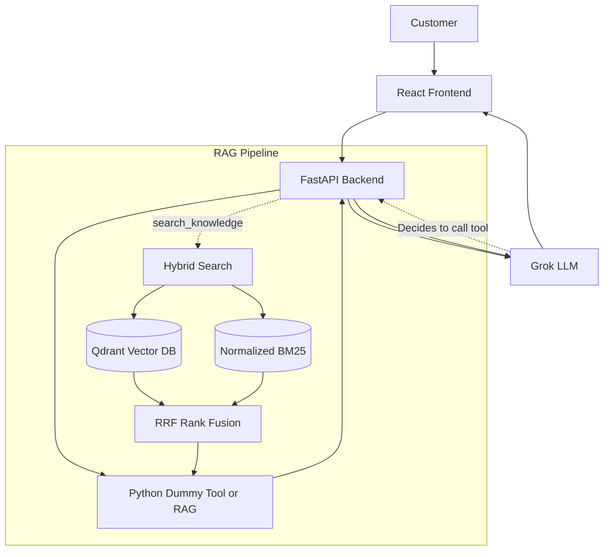

# NOVA Support Widget

A complete, working AI customer-support widget demonstrating LLM tool calling, structured UI updates, and a genuine Retrieval-Augmented Generation (RAG) pipeline.

## Architecture

This project consists of a React frontend and a FastAPI backend. It leverages the Grok LLM for reasoning and conversation, and Google Gemini for document embeddings.



## How It Works

### React UI (Frontend)
- The frontend closely matches the visual fidelity of the provided assignment screenshots.
- It connects to FastAPI using standard REST for actions like tool toggling and document uploads, and uses Server-Sent Events (SSE) for real-time chat streaming.
- **Tool Visibility**: When the LLM calls a tool, the backend sends a structured `tool_call` event. The React UI instantly renders this state (`🔧 Calling...`, `🔄 Executing...`, `✓ Completed`), giving the evaluator full visibility into the AI's actions.

### Backend (FastAPI)
- Exposes minimal endpoints to power the chat experience and manage configuration.
- **`agent.py`**: Handles communication with the Grok API (via standard OpenAI-compatible REST endpoints). It streams responses, detects when Grok requests a tool, executes it locally, appends the result to the conversation context, and requests the next generation from Grok.
- **`tools.py`**: Defines standard customer support tools with dummy data (`get_customer`, `get_order_status`, etc.) and exposes their JSON Schema for the LLM.

### RAG Pipeline (`rag.py`)
- **Ingestion & Chunking**: Uploaded documents (TXT, PDF, MD) undergo sentence-aware chunking (~350 words) with a **60-word sliding window overlap** and **section heading extraction** (`[Section: {heading}]`). Gemini generates dense 768d embeddings (`models/gemini-embedding-001`) for each chunk stored in Qdrant, paired with a normalized BM25 corpus.
- **Hybrid Retrieval & Query Rewriting**: Dense vector search in Qdrant (filtered at similarity `score >= 0.30`) is combined with normalized sparse BM25 keyword search. Follow-up turns automatically rewrite and expand queries using preceding context.
- **Reciprocal Rank Fusion (RRF)**: Rankings from Qdrant and BM25 are combined using standard Reciprocal Rank Fusion ($S_{rrf} = \sum \frac{1}{k + r(d)}$). Results are sorted and the top 4 highest-quality chunks (`rerank_k=4`) are fed to the LLM context.

## Setup Instructions

### Environment Variables
Copy `.env.example` to `.env` in the `backend/` directory and populate your keys:
```
GROK_API_KEY=your_xai_key
GROK_MODEL=grok-beta
GEMINI_API_KEY=your_google_key
GEMINI_EMBEDDING_MODEL=models/text-embedding-004
QDRANT_URL=your_cluster_url # Leave blank for local memory testing
QDRANT_API_KEY=your_qdrant_key
```

### Running the Backend
1. Open a terminal and navigate to `project/backend`.
2. Create and activate a virtual environment:
   ```bash
   python -m venv venv
   source venv/bin/activate  # On Windows: .\venv\Scripts\activate
   ```
3. Install dependencies:
   ```bash
   pip install -r requirements.txt
   ```
4. Start the server:
   ```bash
   uvicorn main:app --reload
   ```

### Running the Frontend
1. Open a terminal and navigate to `project/frontend`.
2. Install dependencies:
   ```bash
   npm install
   ```
3. Start the dev server:
   ```bash
   npm run dev
   ```

## Example Questions to Test

- **Tool Calling**: "Where is my order ORD-1001?" -> (Expect `get_order_status`)
- **Multiple Tools**: "Tell me my subscription and what features my plan includes for john@example.com." -> (Expect `get_subscription` then `get_product_information`)
- **RAG**: "What is the refund policy?" -> (Expect `search_knowledge`, requires a document to be uploaded first in the UI).
- **Action**: "My payment failed for john@example.com. Create a support ticket." -> (Expect `create_support_ticket`).
